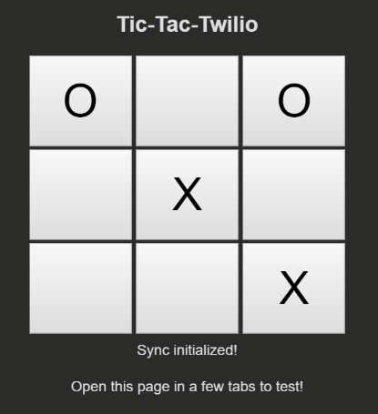

# Sync Quickstart for Python

This application should give you a ready-made starting point for writing your
own real-time apps with Sync. Before we begin, we need to collect
all the config values we need to run the application:

| Config Values  | Description |
| :-------------  |:------------- |
Service Instance SID | A [service](https://www.twilio.com/docs/api/sync/rest/services) instance where all the data for our application is stored and scoped. Generate one using the command below.
Account SID | Your primary Twilio account identifier - find this [in the console here](https://www.twilio.com/console).
API Key | Used to authenticate - [generate one here in the console](https://www.twilio.com/console/dev-tools/api-keys).
API Secret | Used to authenticate - [just like the above, you can use the console to generate one here](https://www.twilio.com/console/dev-tools/api-keys).

## Temporary: Generating a Service Instance

During the Sync developer preview, you will need to generate Sync service
instances via API until the Console GUI is available. Using the API key pair you
generated above, generate a service instance via REST API with this command:

```bash
curl -X POST https://preview.twilio.com/Sync/Services \
 -d 'FriendlyName=MySyncServiceInstance' \
 -u 'SKXXXXXXXXXXXXXXXXXXXXXXXXXXXXXXXX:your_api_secret'
```

## A Note on API Keys

When you generate an API key pair at the URLs above, your API Secret will only
be shown once - make sure to save this in a secure location, 
or possibly your `~/.bash_profile`.

## Setting Up The Python Application

This application uses the lightweight [Flask Framework](http://flask.pocoo.org/). 
Begin by creating a configuration file for your application:

```bash
cp .env.example .env
```

Edit `.env` with the four configuration parameters we gathered from above. Export
the configuration in this file as system environment variables like so on Unix
based systems:

```bash
source .env
```

Next, we need to install our depenedencies:

```bash
sudo pip install -r requirements.txt
```

Now we should be all set! Run the application using the `python` command.

```bash
python app.py
```

Your application should now be running at [http://localhost:4567](http://localhost:4567). 
Open this page in a couple browsers or tabs, and start playing!



## License

MIT
